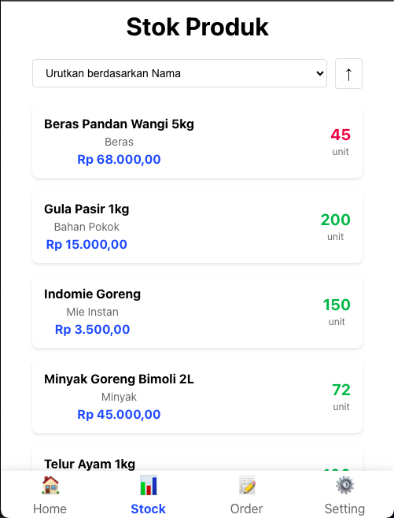

# LPS (Local Product Sales) 📱

A mobile-first React application designed to help salespeople manage store orders efficiently. This app streamlines the process of taking orders from local stores, managing product inventory, and tracking order history.

## 🌟 Features

### 1. Store Management
- View list of registered stores
- Add new stores with details
- Quick access to store purchase history


### 2. Product Inventory
- Complete product catalog with prices
- Real-time stock monitoring
- Sort products by name, category, or stock level
- Visual indicators for low stock items


### 3. Order Processing
- Intuitive shopping cart interface
- Quick quantity adjustments
- Real-time total calculation
- Order summary before checkout


### 4. Order History
- View orders by date
- Detailed order information
- Easy date navigation with calendar
- Complete order history tracking


## 🚀 Getting Started

### Prerequisites
- Node.js
- npm
- Firebase account

### Installation

1. Clone the repository

```bash
git clone https://github.com/yourusername/lps.git
```

2. Install dependencies
```bash
npm install
```

3. Set up environment variables
```bash
cp .env.sample .env
```
Then edit `.env` with your Firebase credentials

4. Start the development server
```bash
npm start
```

## 🛠️ Built With

- [React](https://reactjs.org/) - Frontend framework
- [Firebase](https://firebase.google.com/) - Backend and database
- [React Router](https://reactrouter.com/) - Navigation
- [React DatePicker](https://reactdatepicker.com/) - Date selection

## 📱 Mobile-First Design

The app is designed primarily for mobile use, making it perfect for salespeople on the go. All features are optimized for mobile screens while remaining fully functional on desktop.

## 💡 Usage

1. **Home Screen**: View and manage store list
2. **Stock**: Check and update product inventory
3. **Purchase**: Select products and create orders
4. **Order History**: Track all transactions by date

## 🤝 Contributing

Contributions are welcome! Please feel free to submit a Pull Request.

## 📄 License

This project is licensed under the MIT License - see the LICENSE file for details

## 🙏 Acknowledgments

- Create React App team
- Firebase team
- All contributors

## PROJECT CAN BE IMPROVED COMING SOON